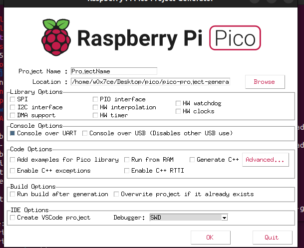
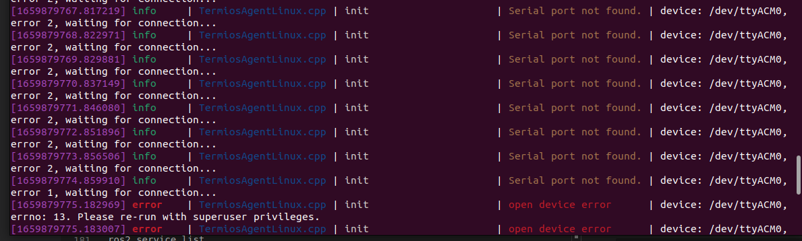
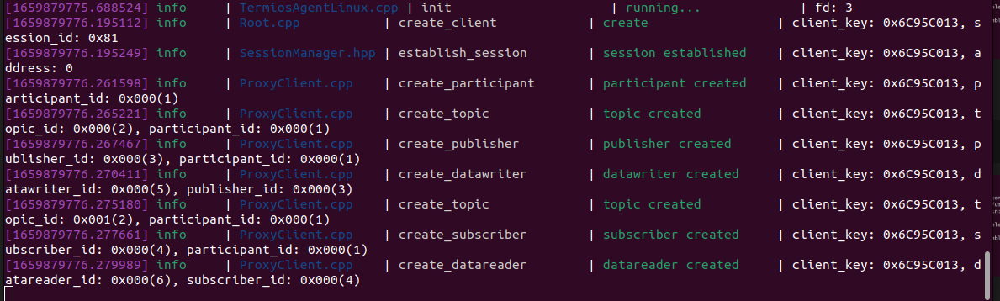
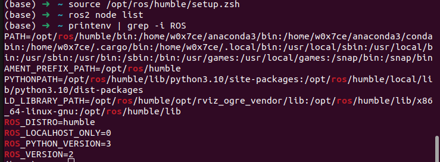
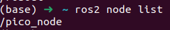
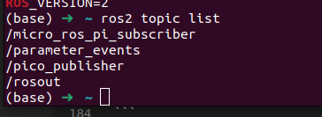
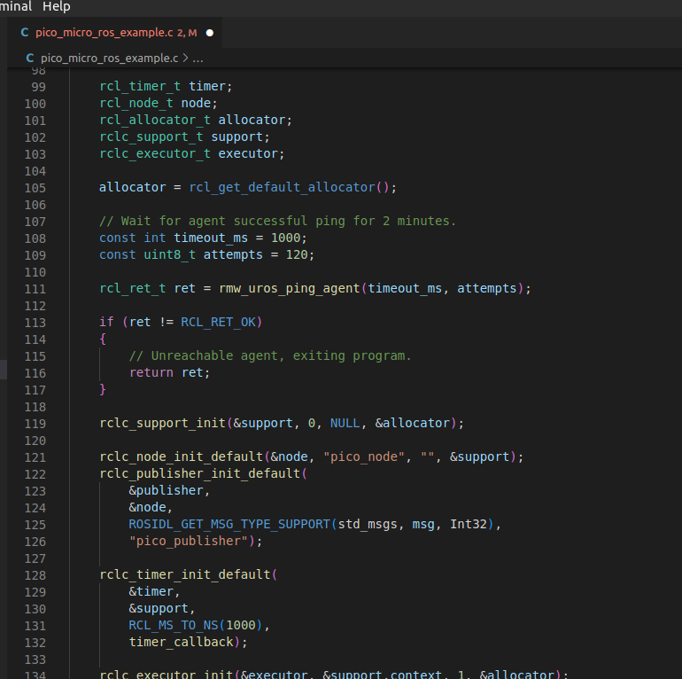
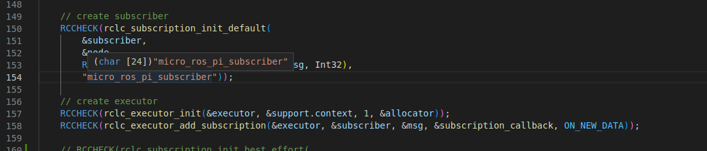

# 基于c++的树莓派pico的闭环电机控制与ros控制方案


## 环境配置

<https://github.com/raspberrypi/pico-sdk>

安装相关软件包

1. 安装 CMake (3.13以上版本), 和支持arm架构的gcc编译器

    ```bash
    sudo apt install cmake gcc-arm-none-eabi libnewlib-arm-none-eabi libstdc++-arm-none-eabi-newlib
    ```

2. 配置环境变量 确保可以正确的调用 Pico-SDK 开发套件

    ```bash
    git clone https://github.com/raspberrypi/pico-sdk ~/pico-sdk
    export PICO_SDK_PATH={pico-sdk下载的路径}
    ```

## 创建项目

1. 在合适的路径下

```bash
mkdir ~/pico_project
cd ~/pico_project
```

2. 复制 在 SDK 里面的 [pico_sdk_import.cmake](https://github.com/raspberrypi/pico-sdk/blob/master/external/pico_sdk_import.cmake) 到我们的项目根路径

```bash
cp ~/pico-sdk/external/pico_sdk_import.cmake ~/pico_project
```

3. 参考 [pico-example](https://github.com/raspberrypi/pico-examples)  编写 `CMakeLists.txt` 对于电机控制的项目我的代码是这样的:

    ```cmake
    cmake_minimum_required(VERSION 3.13)

    include(pico_sdk_import.cmake)

    project(my_project)

    # 初始化 pico-sdk 开发套件
    pico_sdk_init()

    add_executable(motor_control)

    pico_generate_pio_header(motor_control ${CMAKE_CURRENT_LIST_DIR}/quadrature_encoder.pio)

    target_sources(motor_control PRIVATE motor_control.cpp)


    # 连接相关的依赖
    target_link_libraries(motor_control PRIVATE
            pico_stdlib
            pico_multicore
            hardware_pio
            hardware_pwm
            )

    # 启用 usb 串口输出 禁用 uart 输出
    pico_enable_stdio_usb(motor_control 1)
    pico_enable_stdio_uart(motor_control 0)

    # 创建 map/bin/hex/uf2 类型烧录文件.
    pico_add_extra_outputs(motor_control)
    ```

## 编写项目代码

经过上面的步骤我们完成了环境的配置 下边可以开始编写功能代码。

### PWM 驱动电机

我们选用的是L298N电机驱动

</img>

可同时控制两个直流减速电机做不同动作，在6V到46V的电压范围内，提供2安培的电流，并且具有过热自断和反馈检测功能。正确接线后，在软件层面，我们只需要使能对应的输出，通过调整输出的pwm信号就可以驱动电机旋转。

pico有一个频率为125Mhz的pwm时钟，这个时钟8ns计数一次，内部计数器连续计数，到达65535后 重新回到0.

我们可以利用它生成一个 周期为4ns ，占空比为50% 的PWM信号如

25000kHZ=25mHz
4us / 8ns = 500 Cycles //我们可让pico 计数到五百个为一组
250 / 500 = 50%
V-pwm = 3.3*50% = 1.65V 在高频的情况下我们也可以将其视为一个1.65V的信号  

代码如下

   ```c
    #include <stdio.h>
    #include "pico/stdlib.h"
    #include "hardware/timer.h"
    #include "hardware/pwm.h"

    #include "iostream"

    int wrap;

    int main() {
        gpio_set_function(GPIO_motor_pwm, GPIO_FUNC_PWM);
        uint slice_num = pwm_gpio_to_slice_num(GPIO_motor_pwm);

        wrap = 500; // 25Mhz
        // wrap = 62500; // 2khz
        // wrap = 12500 ; //should be 10 kHz 
        // wrap = 1250; // should be 100 kHz 
        pwm_set_wrap(slice_num, wrap);
        pwm_set_enabled(slice_num, true);

        pwm_set_chan_level(slice_num, PWM_CHAN_A, 0.5*wrap);
    }
   ```

这样就可以调制出对应的波形

### 编码器数值读取与闭环控制  

通过以上的步骤 我们可用调制出需要的pwm信号，现在我们利用编码器来获取电机转动的相对速度，下面以便于理解的增量式PID来举例说明。

**此步骤需要调用 [quadrature_encoder.pio](https://github.com/raspberrypi/pico-examples/blob/master/pio/quadrature_encoder/quadrature_encoder.pio) 在开始前我们需要先拷贝此文件**

1. 定义一个便于实现PID的类

```c++
class PID_class
{
    private:
        float kp, ki, kd;
        float err, last_err;
        float err_i;
        float err_d;
        float fix;

    public:
        PID_class(int p, int i, int d)
        {
            kp = p;
            ki = i;
            kd = d;
            std::cout << kp << " " << ki << " " << kd;
        };

        void PID_init(int p, int i, int d)
        {
            PID_class(p, i, d);
        };

        void PID_change(int p, int i, int d)
        {
            kp = p;
            ki = i;
            kd = d;
            std::cout << kp << " " << ki << " " << kd;
        };

        int caculate(int now, int target)
        {
            err = target - now;
            err_i += err;
            err_d = err - last_err;
            last_err = err;

            fix = kp * err + ki * err_i + kd * err_d;
            return fix;
        }
        
} PID(5, 0.5, 0);
```

2. 读取编码器的值 调用 PID 并自动调节输出脉冲的占空比

```c++
#include <stdio.h>
#include "pico/stdlib.h"
#include "hardware/pio.h"
#include "hardware/timer.h"
#include "hardware/pwm.h"

#include "iostream"

#include "quadrature_encoder.pio.h"

int wrap;
int GPIO_motor_pwm = 6;

/// 定义 PID_class 代码在上面部分 
/// 复制粘贴到这里即可 在根据实际情况修改参数
/// 此处省略

int main()
{
    int new_value, delta, old_value = 0;

    //编码器一根线接到Pin10 另外一根接到11
    const uint PIN_AB = 10;

    stdio_init_all();

    PIO pio = pio0;
    const uint sm = 0;

    uint offset = pio_add_program(pio, &quadrature_encoder_program);
    quadrature_encoder_program_init(pio, sm, offset, PIN_AB, 0);

    // 选择输出 pwm 的引脚 用作控制信号传入L298n 电机驱动并完成初始化
    gpio_set_function(GPIO_motor_pwm, GPIO_FUNC_PWM);
    uint slice_num = pwm_gpio_to_slice_num(GPIO_motor_pwm);
    wrap = 62500; // 2khz
    pwm_set_wrap(slice_num, wrap);
    pwm_set_enabled(slice_num, true);

    // 在这里我们设定默认输出 占空比为0 即 静止状态
    float output_pwm = 0; // 12000

    while (1)
    {
        // 读取编码器的数值
        
        new_value = quadrature_encoder_get_count(pio, sm);
        delta = new_value - old_value; //获取反应速度的相对数值
        old_value = new_value;

        // 调用PID 第一个参数 传入当前值， 第二个参数 传入我们理想的速度值， 可用根据不同编码器的脉冲数来进行对应映射的计算，算出角速度。如果只是需要反应速度的快慢，想提速就增大第二个参数值即可，然后转速就会随之改变，最后实时速度的数值会趋于第二个参数，即目标速度
        
        output_pwm += PID.caculate(delta, 12);

        // 我们需要对 pwm 进行 限幅 
        // 有两个原因 一是起到保护作用 二是pico 计数不能超过 65535 
        
        if (output_pwm > 65000)
        {
            output_pwm = 65000;
        }

        if (output_pwm < 0)
        {
            output_pwm = 0;
        }

        pwm_set_chan_level(slice_num, PWM_CHAN_A, output_pwm);

        std::cout << "position " << new_value << " delta " << delta << "  pwm " << output_pwm*100/62500 <<"%" << std::endl;

        sleep_ms(2);
    }
}

```

## 编译代码与调试

### 编译

进入项目目录 创建并进入 build 目录,在修改 CMakeLists.txt 后需要重新执行 " cmake .. ", 修改 cpp 源代码 只需要重新执行 make 完成编译

```bash
cd ~/pico_project
mkdir build
cd build
cmake ..
make
```

### 烧录

```bash
cp ~/pico_project/build/motor_control.uf2 /media/$USER/RPI-RP2
```
### 调试

```bash
sudo minicom -D /dev/serial/by-id/usb-Raspberry_Pi_Pico_E6605481DB64B936-if00
```

### 番外篇

对于 pico 我们也可以选择自动创建程序的方法 快速完成对应功能初始化，我们可以去研究探索
#### 自动创建程序

```bash
$ git clone https://github.com/raspberrypi/pico-project-generator.git
It can then be run in graphical mode,
$ cd pico-project-generator
$ ./pico_project.py --gui
```

<div></div>

# 安装 ROS 

### 设置语言格式

我们需要设置语言格式为UTF-8

```bash

locale  # 检查 UTF-8 环境

sudo apt update && sudo apt install locales
sudo locale-gen en_US en_US.UTF-8
sudo update-locale LC_ALL=en_US.UTF-8 LANG=en_US.UTF-8
export LANG=en_US.UTF-8

locale  # 确认设置改变

```

### 设置ROS2软件包源

我们需要将ROS 2 apt软件库添加到系统中。

我们可以通过检查下面命令的输出，来进行判断Universe 仓库是否使用

```bash
apt-cache policy | grep universe
```

如果已经启用 会看到类似的输出

```bash
500 http://mirrors.ustc.edu.cn/ubuntu jammy-proposed/universe i386 Packages
    release v=22.04,o=Ubuntu,a=jammy-proposed,n=jammy,l=Ubuntu,c=universe,b=i386
500 http://mirrors.ustc.edu.cn/ubuntu jammy-proposed/universe amd64 Packages
    release v=22.04,o=Ubuntu,a=jammy-proposed,n=jammy,l=Ubuntu,c=universe,b=amd64
500 http://mirrors.ustc.edu.cn/ubuntu jammy-security/universe i386 Packages
    release v=22.04,o=Ubuntu,a=jammy-security,n=jammy,l=Ubuntu,c=universe,b=i386
500 http://mirrors.ustc.edu.cn/ubuntu jammy-security/universe amd64 Packages
    release v=22.04,o=Ubuntu,a=jammy-security,n=jammy,l=Ubuntu,c=universe,b=amd64

```

如果没有启用 ， 可以通过下面方式来确保Ubuntu Universe 仓库已经启用。

```bash
sudo apt install software-properties-common
sudo add-apt-repository universe
```

### 在系统中添加 ROS 2 apt仓库

1. 首先用apt授权我们的GPG密钥。

    ```bash
    sudo apt update && sudo apt install curl gnupg lsb-release
    sudo curl -sSL https://raw.githubusercontent.com/ros/rosdistro/master/ros.key -o /usr/share/keyrings/ros-archive-keyring.gpg
    ```

2. 然后将该资源库添加到你的源列表中

    ```bash
    echo "deb [arch=$(dpkg --print-architecture) signed-by=/usr/share/keyrings/ros-archive-keyring.gpg] http://packages.ros.org/ros2/ubuntu $(source /etc/os-release && echo $UBUNTU_CODENAME) main" | sudo tee /etc/apt/sources.list.d/ros2.list > /dev/null
    ```

### 安装ROS 2软件包

1. 更新 apt 源 以及 系统软件 

    ```bash
    sudo apt update && sudo apt upgrade
    ```

2. a 完整包安装包括 ROS, RViz, demos, tutorials. 可以通过下面的方式。

    ```bash
    sudo apt install ros-humble-desktop
    ```

    b. ROS-基础安装，包含通信库、信息包、命令行工具。没有图形化工具，可以这样。

    ```bash
    sudo apt install ros-humble-ros-base
    ```

### 环境设置

当我们每次需要使用 ROS cli 时候 需要使能相关环境变量，我们可以很方便的利用 source 来启用。

```bash
source /opt/ros/humble/setup.bash //  bash 用这个
source /opt/ros/humble/setup.zsh //  zsh 用这个
```

## 树莓派 pico 测试固件烧录

###  安装Pico SDK

首先，确保Pico SDK已正确安装和配置。 可以查看之前部分。

### 编译实例

一旦Pico SDK准备好了，就可以编译这个[demo](https://github.com/micro-ROS/micro_ros_raspberrypi_pico_sdk)了。

```bash
git clone https://github.com/micro-ROS/micro_ros_raspberrypi_pico_sdk
cd micro_ros_raspberrypi_pico_sdk
mkdir build
cd build
cmake ..
make
```

### 烧录

按住启动按钮，插入USB并运行。

```bash
cp pico_micro_ros_example.uf2 /media/$USER/RPI-RP2
```

### 启动 Micro-ROS agent 服务

Micro-ROS遵循客户端-服务器架构，所以我们需要启动Micro-ROS agent。
我们可以使用 Docker 或者 Snap 来快速启用 micro-ros-agent 。

#### Docker 方式

```bash
docker run -it --rm -v /dev:/dev --privileged --net=host microros/micro-ros-agent:humble serial --dev /dev/ttyACM0 -b 115200
```

#### Snap 方式

```bash
sudo snap install micro-ros-agent
```

安装后，由于我们使用的是USB连接，需要启用热拔插功能。

```bash
sudo snap set core experimental.hotplug=true
```

并重新启动snap demon，这样它就会生效

```bash
sudo systemctl restart snapd
```

sudo micro-ros-agent serial --dev /dev/ttyACM0 baudrate=115200

<div></div>
<div></div>

**注意** 我们需要确保运行时候有如下类似的输出,这样才能通过 ros2 topic命令控制

```bash
1662815825.767103] info     | Root.cpp           | set_verbose_level        | logger setup           | verbose_level: 4
[1662815826.287222] info     | Root.cpp           | create_client            | create                 | client_key: 0x7CDA0302, session_id: 0x81
[1662815826.287330] info     | SessionManager.hpp | establish_session        | session established    | client_key: 0x7CDA0302, address: 0
[1662815826.335625] info     | ProxyClient.cpp    | create_participant       | participant created    | client_key: 0x7CDA0302, participant_id: 0x000(1)
[1662815826.340206] info     | ProxyClient.cpp    | create_topic             | topic created          | client_key: 0x7CDA0302, topic_id: 0x000(2), participant_id: 0x000(1)
[1662815826.342668] info     | ProxyClient.cpp    | create_publisher         | publisher created      | client_key: 0x7CDA0302, publisher_id: 0x000(3), participant_id: 0x000(1)
[1662815826.345629] info     | ProxyClient.cpp    | create_datawriter        | datawriter created     | client_key: 0x7CDA0302, datawriter_id: 0x000(5), publisher_id: 0x000(3)
[1662815826.349394] info     | ProxyClient.cpp    | create_topic             | topic created          | client_key: 0x7CDA0302, topic_id: 0x001(2), participant_id: 0x000(1)
[1662815826.353930] info     | ProxyClient.cpp    | create_publisher         | publisher created      | client_key: 0x7CDA0302, publisher_id: 0x001(3), participant_id: 0x000(1)
[1662815826.356838] info     | ProxyClient.cpp    | create_datawriter        | datawriter created     | client_key: 0x7CDA0302, datawriter_id: 0x001(5), publisher_id: 0x001(3)
[1662815826.361678] info     | ProxyClient.cpp    | create_topic             | topic created          | client_key: 0x7CDA0302, topic_id: 0x002(2), participant_id: 0x000(1)
[1662815826.364943] info     | ProxyClient.cpp    | create_subscriber        | subscriber created     | client_key: 0x7CDA0302, subscriber_id: 0x000(4), participant_id: 0x000(1)
[1662815826.368520] info     | ProxyClient.cpp    | create_datareader        | datareader created     | client_key: 0x7CDA0302, datareader_id: 0x000(6), subscriber_id: 0x000(4)
[1662815826.372275] info     | ProxyClient.cpp    | create_topic             | topic created          | client_key: 0x7CDA0302, topic_id: 0x003(2), participant_id: 0x000(1)
[1662815826.374362] info     | ProxyClient.cpp    | create_subscriber        | subscriber created     | client_key: 0x7CDA0302, subscriber_id: 0x001(4), participant_id: 0x000(1)
[1662815826.378724] info     | ProxyClient.cpp    | create_datareader        | datareader created     | client_key: 0x7CDA0302, datareader_id: 0x001(6), subscriber_id: 0x001(4)

```

## PC 端简单 ROS 操作

### 查看ROS开发相关环境变量

```bash
printenv | grep -i ROS
```
<div></div>

### ros2 状态的查看

查看可用的 node

```bash
ros2 node list
```

输出
<div></div>

查看可用的 topic 

```bash
ros2 topic list
```
输出

<div></div>


我们可以发现其对应代码里面的这两个部分

- publish

<div></div>

- subscribe

<div></div>

## micro-ros 程序开发

### 消息发布

#### 通过 while 功能实现执行到特定位置发送特定信息

```c++
int main(){
    /// 其他部分初始化及功能
    rclc_publisher_init_default(
            &publisher_diy,
            &node,
            ROSIDL_GET_MSG_TYPE_SUPPORT(std_msgs, msg, Int32),
            "pico_publisher_diy");

    while(1){}
    /// 其他部分初始化及功能
        rcl_ret_t ret_diy = rcl_publish(&publisher_diy, &msg_diy, NULL);
        msg_diy.data *= -1;
    }
}

```


#### 通过回调函数发送特定信息

```c++
void timer_callback(rcl_timer_t *timer, int64_t last_call_time)
{
    rcl_ret_t ret = rcl_publish(&publisher_base, &msg_base, NULL);
    msg_base.data++;
}
int main(){
    /// 其他部分初始化及功能
    rclc_publisher_init_default(
        &publisher_base,
        &node,
        ROSIDL_GET_MSG_TYPE_SUPPORT(std_msgs, msg, Int32),
        "pico_publisher_base");
    
    while(1){
        /// 其他部分初始化及功能
    }

}
```

### 消息订阅

```c++
void subscription_callback_diy(const void *msgin_diy)
{
    // Cast received message to used type
    const std_msgs__msg__Int32 *msg_diy = (const std_msgs__msg__Int32 *)msgin_diy;

    float _value = (float)msg_diy->data / 100 ;
    pwm_set_chan_level(slice_num, PWM_CHAN_A, _value * 62500);

}

int main(){

/// 其他部分初始化及功能

    rclc_subscription_init_default(
            &subscriber_diy,
            &node,
            ROSIDL_GET_MSG_TYPE_SUPPORT(std_msgs, msg, Int32),
            "subscriber_diy");

    rclc_executor_add_subscription(&executor, &subscriber_diy, &msg_diy_sub, &subscription_callback_diy, ON_NEW_DATA);

    while(1){
        // 其他功能
        ;
    }
    return 0;
}

```

### 多订阅 多发布示例

通过此示例可以实现GPIO6 的pwm输出控制 通过 ros topic list 来查看 topic 并实现对应功能

```bash
## 对于 订阅
ros2 topic pub /xxx std_msgs/Int32 "data: 28" -t 1

## 对于发布
ros2 topic echo xxx
```

pico 示例代码

```c++
#include <stdio.h>

#include "hardware/pio.h"
#include "hardware/timer.h"
#include "hardware/pwm.h"
#include "quadrature_encoder.pio.h"

#include <rcl/rcl.h>
#include <rcl/error_handling.h>
#include <rclc/rclc.h>
#include <rclc/executor.h>
#include <std_msgs/msg/int32.h>
#include <rmw_microros/rmw_microros.h>

#include "pico/stdlib.h"
#include "pico_uart_transports.h"

const uint LED_PIN = 25;
uint slice_num;

rcl_publisher_t publisher_base;
std_msgs__msg__Int32 msg_base;

rcl_publisher_t publisher_diy;
std_msgs__msg__Int32 msg_diy;

rcl_subscription_t subscriber_base;
std_msgs__msg__Int32 msg_base_sub;

rcl_subscription_t subscriber_diy;
std_msgs__msg__Int32 msg_diy_sub;

void timer_callback(rcl_timer_t *timer, int64_t last_call_time)
{
    rcl_ret_t ret = rcl_publish(&publisher_base, &msg_base, NULL);
    msg_base.data++;
}

int k = 1;

void subscription_callback_base(const void *msgin_base)
{
    // Cast received message to used type
    const std_msgs__msg__Int32 *msg_base = (const std_msgs__msg__Int32 *)msgin_base;

    // Process message
    // printf("Received: %d\n", msg_base->data);
    if (k > 0)
    {
        gpio_set_dir(LED_PIN, 1);
    }
    else
    {
        gpio_set_dir(LED_PIN, 0);
    }
    k *= -1;
    pwm_set_chan_level(slice_num, PWM_CHAN_A, 0.2* 62500);
}

void subscription_callback_diy(const void *msgin_diy)
{
    // Cast received message to used type
    const std_msgs__msg__Int32 *msg_diy = (const std_msgs__msg__Int32 *)msgin_diy;

    float _value = (float)msg_diy->data / 100 ;
    pwm_set_chan_level(slice_num, PWM_CHAN_A, _value * 62500);

}


int main()
{
    stdio_init_all();

    rmw_uros_set_custom_transport(
        true,
        NULL,
        pico_serial_transport_open,
        pico_serial_transport_close,
        pico_serial_transport_write,
        pico_serial_transport_read);

    gpio_init(LED_PIN);
    gpio_set_dir(LED_PIN, GPIO_OUT);

    int wrap;
    int GPIO_motor_pwm = 6;
    gpio_set_function(GPIO_motor_pwm, GPIO_FUNC_PWM);
    slice_num = pwm_gpio_to_slice_num(GPIO_motor_pwm);
    wrap = 62500; // 2khz
    // wrap = 12500 ; //should be 10 khz right
    pwm_set_wrap(slice_num, wrap);
    pwm_set_enabled(slice_num, true);
    pwm_set_chan_level(slice_num, PWM_CHAN_A, 0.5 * 62500);

    rcl_timer_t timer;
    rcl_node_t node;
    rcl_allocator_t allocator;
    rclc_support_t support;
    rclc_executor_t executor;

    allocator = rcl_get_default_allocator();

    // Wait for agent successful ping for 2 minutes.
    const int timeout_ms = 1000;
    const uint8_t attempts = 120;

    rcl_ret_t ret = rmw_uros_ping_agent(timeout_ms, attempts);

    if (ret != RCL_RET_OK)
    {
        // Unreachable agent, exiting program.
        return ret;
    }

    rclc_support_init(&support, 0, NULL, &allocator);

    rclc_node_init_default(&node, "pico_node", "", &support);
    rclc_publisher_init_default(
        &publisher_base,
        &node,
        ROSIDL_GET_MSG_TYPE_SUPPORT(std_msgs, msg, Int32),
        "pico_publisher_base");

    rclc_publisher_init_default(
        &publisher_diy,
        &node,
        ROSIDL_GET_MSG_TYPE_SUPPORT(std_msgs, msg, Int32),
        "pico_publisher_diy");

    rclc_subscription_init_default(
        &subscriber_base,
        &node,
        ROSIDL_GET_MSG_TYPE_SUPPORT(std_msgs, msg, Int32),
        "subscriber_base");

    rclc_subscription_init_default(
        &subscriber_diy,
        &node,
        ROSIDL_GET_MSG_TYPE_SUPPORT(std_msgs, msg, Int32),
        "subscriber_diy");

    rclc_timer_init_default(
        &timer,
        &support,
        RCL_MS_TO_NS(1000),
        timer_callback);

    rclc_executor_init(&executor, &support.context, 5, &allocator);
    rclc_executor_add_timer(&executor, &timer);

    rclc_executor_add_subscription(&executor, &subscriber_base, &msg_base_sub, &subscription_callback_base, ON_NEW_DATA);
    rclc_executor_add_subscription(&executor, &subscriber_diy, &msg_diy_sub, &subscription_callback_diy, ON_NEW_DATA);

    gpio_put(LED_PIN, 1);

    msg_base.data = 0;

    msg_diy.data = 1;

    while (true)
    {
        rclc_executor_spin_some(&executor, RCL_MS_TO_NS(100));
        rcl_ret_t ret_diy = rcl_publish(&publisher_diy, &msg_diy, NULL);
        msg_diy.data *= -1;

        // printf("Work Well\n");

        sleep_ms(2);
    }
    return 0;
}
```