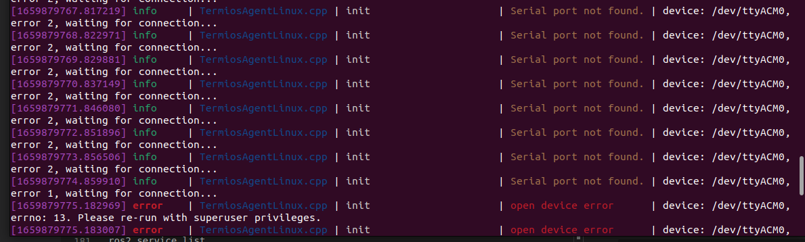
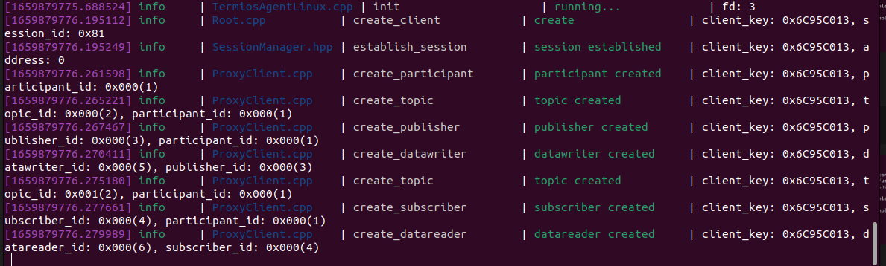
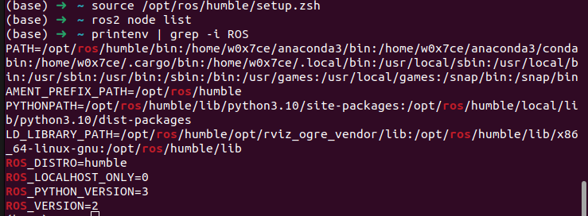
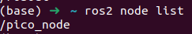
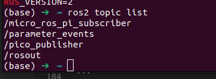
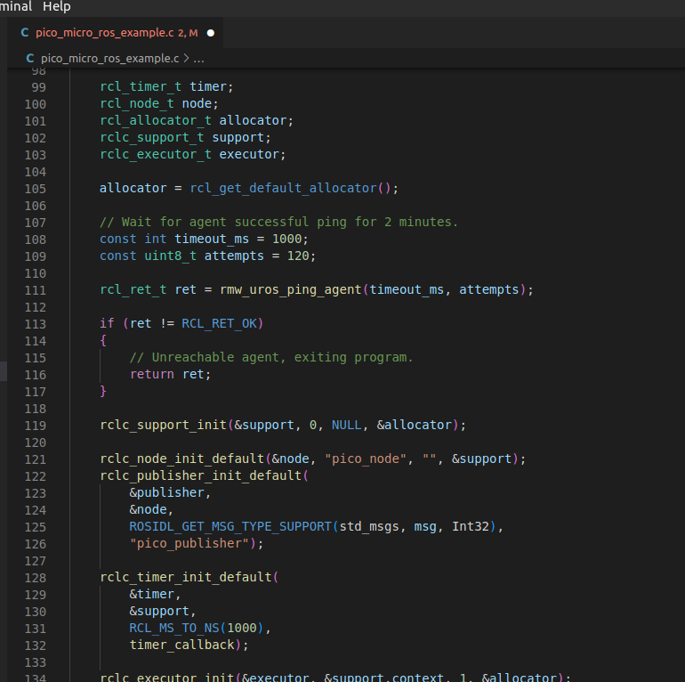
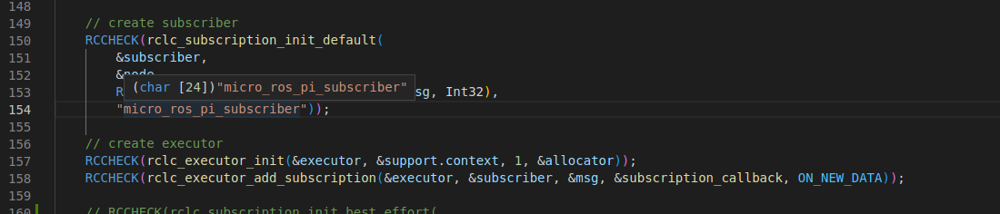
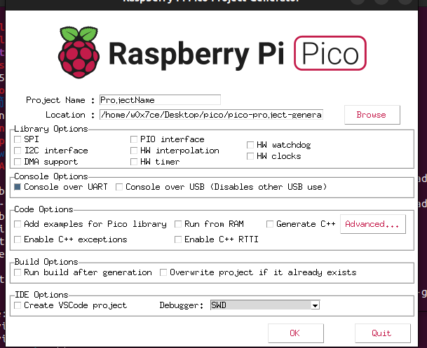

# Develop micro-ros on Raspberry pi pico

## 安装 ROS 

### 设置语言格式

我们需要设置语言格式为UTF-8

```bash

locale  # 检查 UTF-8 环境

sudo apt update && sudo apt install locales
sudo locale-gen en_US en_US.UTF-8
sudo update-locale LC_ALL=en_US.UTF-8 LANG=en_US.UTF-8
export LANG=en_US.UTF-8

locale  # 确认设置改变

```

### 设置ROS2软件包源

我们需要将ROS 2 apt软件库添加到系统中。

我们可以通过检查下面命令的输出，来进行判断Universe 仓库是否使用

```bash
apt-cache policy | grep universe
```

如果已经启用 会看到类似的输出

```bash
500 http://mirrors.ustc.edu.cn/ubuntu jammy-proposed/universe i386 Packages
    release v=22.04,o=Ubuntu,a=jammy-proposed,n=jammy,l=Ubuntu,c=universe,b=i386
500 http://mirrors.ustc.edu.cn/ubuntu jammy-proposed/universe amd64 Packages
    release v=22.04,o=Ubuntu,a=jammy-proposed,n=jammy,l=Ubuntu,c=universe,b=amd64
500 http://mirrors.ustc.edu.cn/ubuntu jammy-security/universe i386 Packages
    release v=22.04,o=Ubuntu,a=jammy-security,n=jammy,l=Ubuntu,c=universe,b=i386
500 http://mirrors.ustc.edu.cn/ubuntu jammy-security/universe amd64 Packages
    release v=22.04,o=Ubuntu,a=jammy-security,n=jammy,l=Ubuntu,c=universe,b=amd64

```

如果没有启用 ， 可以通过下面方式来确保Ubuntu Universe 仓库已经启用。

```bash
sudo apt install software-properties-common
sudo add-apt-repository universe
```

### 在系统中添加 ROS 2 apt仓库

1. 首先用apt授权我们的GPG密钥。

    ```bash
    sudo apt update && sudo apt install curl gnupg lsb-release
    sudo curl -sSL https://raw.githubusercontent.com/ros/rosdistro/master/ros.key -o /usr/share/keyrings/ros-archive-keyring.gpg
    ```

2. 然后将该资源库添加到你的源列表中

    ```bash
    echo "deb [arch=$(dpkg --print-architecture) signed-by=/usr/share/keyrings/ros-archive-keyring.gpg] http://packages.ros.org/ros2/ubuntu $(source /etc/os-release && echo $UBUNTU_CODENAME) main" | sudo tee /etc/apt/sources.list.d/ros2.list > /dev/null
    ```

### 安装ROS 2软件包

1. 更新 apt 源 以及 系统软件 

    ```bash
    sudo apt update && sudo apt upgrade
    ```

2. a 完整包安装包括 ROS, RViz, demos, tutorials. 可以通过下面的方式。

    ```bash
    sudo apt install ros-humble-desktop
    ```

    b. ROS-基础安装，包含通信库、信息包、命令行工具。没有图形化工具，可以这样。

    ```bash
    sudo apt install ros-humble-ros-base
    ```

### 环境设置

当我们每次需要使用 ROS cli 时候 需要使能相关环境变量，我们可以很方便的利用 source 来启用。

```bash
source /opt/ros/humble/setup.bash //  bash 用这个
source /opt/ros/humble/setup.zsh //  zsh 用这个
```

## 树莓派 pico 测试固件烧录

###  安装Pico SDK

首先，确保Pico SDK已正确安装和配置。

micro-ROS的预编译库是用arm-none-eabi-gcc 9.2.1编译的，在构建micro-ROS项目时需要一个兼容版本。你可以用以下命令指定一个编译器路径。


如果想编译安装可以参考[这里](https://developer.arm.com/downloads/-/gnu-rm)


通过 apt 安装

```bash
# Install dependencies
sudo apt install cmake g++ gcc-arm-none-eabi doxygen libnewlib-arm-none-eabi git python3
git clone --recurse-submodules https://github.com/raspberrypi/pico-sdk.git $HOME/pico-sdk

# Configure environment
echo "export PICO_SDK_PATH=$HOME/pico-sdk" >> ~/.bashrc
source ~/.bashrc

```

### 编译实例

一旦Pico SDK准备好了，就可以编译这个demo了。

```bash
cd micro_ros_raspberrypi_pico_sdk
mkdir build
cd build
cmake ..
make
```

### 烧录

按住启动按钮，插入USB并运行。

```bash
cp pico_micro_ros_example.uf2 /media/$USER/RPI-RP2
```

### 启动 Micro-ROS agent 服务

Micro-ROS遵循客户端-服务器架构，所以我们需要启动Micro-ROS agent。
我们可以使用 Docker 或者 Snap 来快速启用 micro-ros-agent 。

#### Docker 方式

```bash
docker run -it --rm -v /dev:/dev --privileged --net=host microros/micro-ros-agent:humble serial --dev /dev/ttyACM0 -b 115200
```

#### Snap 方式

```bash
sudo snap install micro-ros-agent
```

安装后，由于我们使用的是USB连接，需要启用热拔插功能。

```bash
sudo snap set core experimental.hotplug=true
```

并重新启动snap demon，这样它就会生效

```bash
sudo systemctl restart snapd
```

sudo micro-ros-agent serial --dev /dev/ttyACM0 baudrate=115200

<div></div>
<div></div>


## PC 端简单 ROS 操作

### 查看ROS开发相关环境变量

```bash
printenv | grep -i ROS
```
<div></div>

### ros2 状态的查看

查看可用的 node

```bash
ros2 node list
```

输出
<div></div>

查看可用的 topic 

```bash
ros2 topic list
```
输出

<div></div>


我们可以发现其对应代码里面的这两个部分

- publish

<div></div>

- subscribe 

<div></div>

## pico c++ 开发

### 自动创建程序

```bash
$ git clone https://github.com/raspberrypi/pico-project-generator.git
It can then be run in graphical mode,
$ cd pico-project-generator
$ ./pico_project.py --gui
```

<div></div>